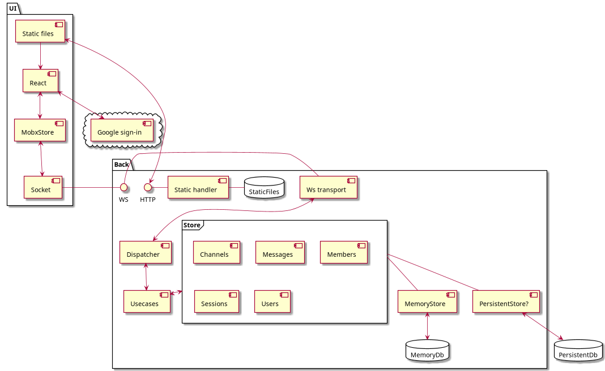

# Readme

jb-chat - test chat with react+mobx at frontend and golang and backend and WebSocket for communications between

## Install

```shell
go get -u github.com/GiDiS/jb-chat
```

## Run at host

Staging: Seeded with GoT data set

```shell
cd "${GOPATH}/src/github.com/GiDiS/jb-chat" && make run-host-staging
```

Production: Run with empty database

```shell
cd "${GOPATH}/src/github.com/GiDiS/jb-chat" && make run-host-prod
```

Listen at http://localhost:8888 for ui
Listen at http://localhost:8889 for diagnostic

## Run in minikube (minikube required)

Staging: Seeded with GoT data set

```shell
cd "${GOPATH}/src/github.com/GiDiS/jb-chat" && make run-staging
```

Production: Run with empty database

```shell
cd "${GOPATH}/src/github.com/GiDiS/jb-chat" && make run-production
```

Service urls printed after deploy

## Stop in minikube (minikube required)
Stop completely remove deploy namespace 

Staging:
```shell
cd "${GOPATH}/src/github.com/GiDiS/jb-chat" && make stop-staging
```

Production:
```shell
cd "${GOPATH}/src/github.com/GiDiS/jb-chat" && make stop-production
```


## Issues (todo):

* UI: reconnect to ws after backend restart
* UI: refresh after channel create, join, leave
* UI: load channel messages on page initial open by direct url
* Back: Persistent storage
* Back: Tests
* Back: Metrics
* Deploy: helm chart
* Deploy: minikube deploy with ingress for stable google sign-in

## App arch


