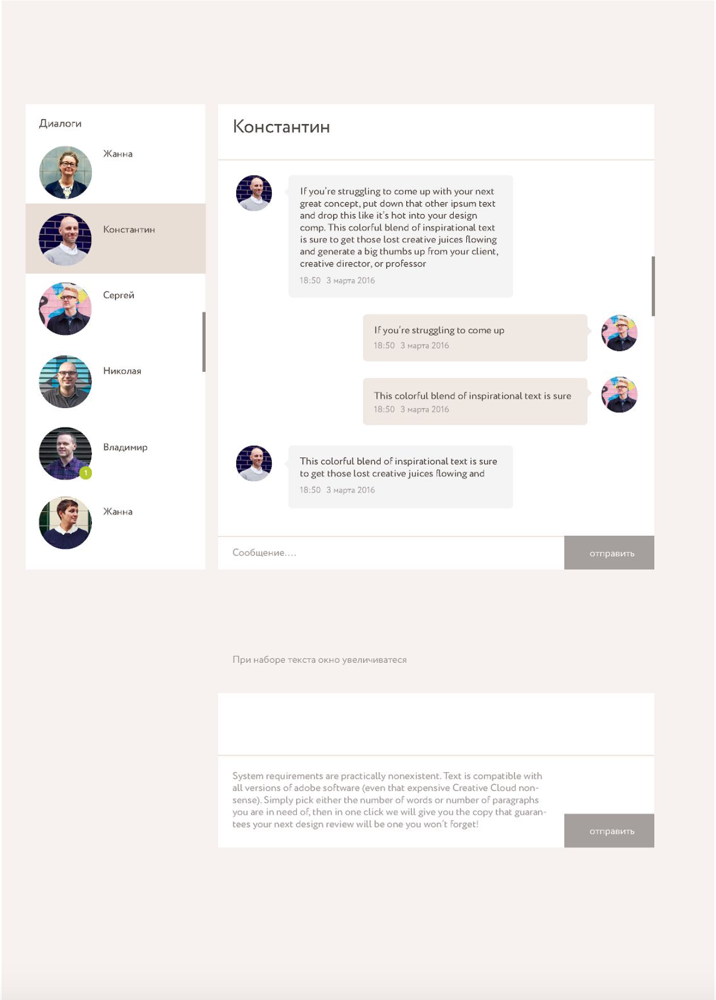

# ТЗ

Нужно создать чат с поддержкой live-update.
Авторизация пользователей через google account. Переписка с любым пользователем, который залогинен. История сообщений должна сохраняться. Дополнительно, можно сделать комнаты и threads.
Реализовать следующий дизайн:
image.png

Также хотелось бы увидеть деплой данного сервиса в локальный Minikube в два окружения: staging и production.
Описать процедуру обновления версии сервиса в дальнейшем.

## Допы:

1. На какое общее количество пользователей и сообщений рассчитывать?

Давай предположим, что на данный момент количество пользователей ~100, количество сообщений - 5000 в день.

2. Какое одновременное количество пользователей онлайн?

Пусть это будет корпоративный чат: онлайн ~80%

3. Логи, метрики нужны?

Да, можно без системы хранения и сбора этой информации. То есть ElasticSearch с Prometheus ставить отдельно не надо )

4. Как и где демонстрацию деплоя проводить или нужен факт его наличия?

Деплоиться будет в Minikube с установленным аддоном ingress.

5. Какие лимиты по CPU и памяти? Или лишь бы работало?

Определите сами.
